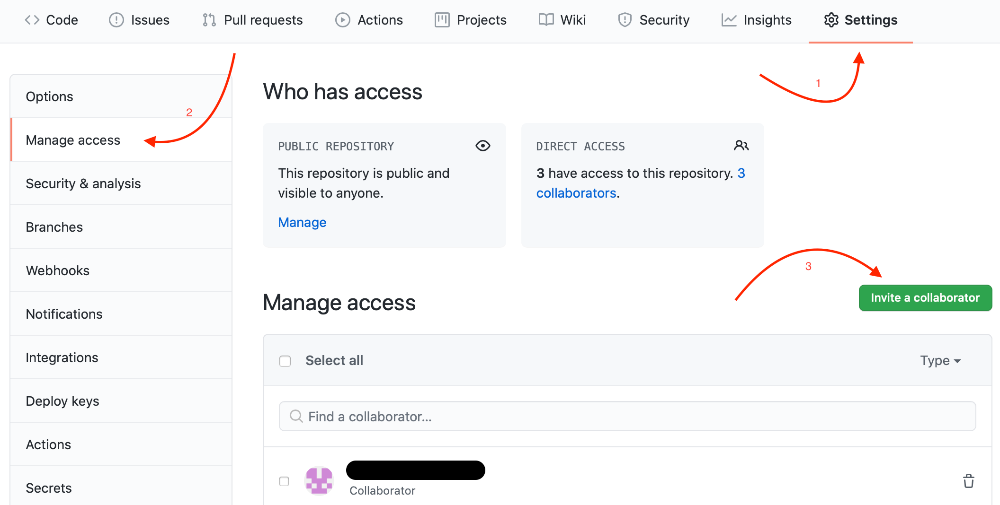
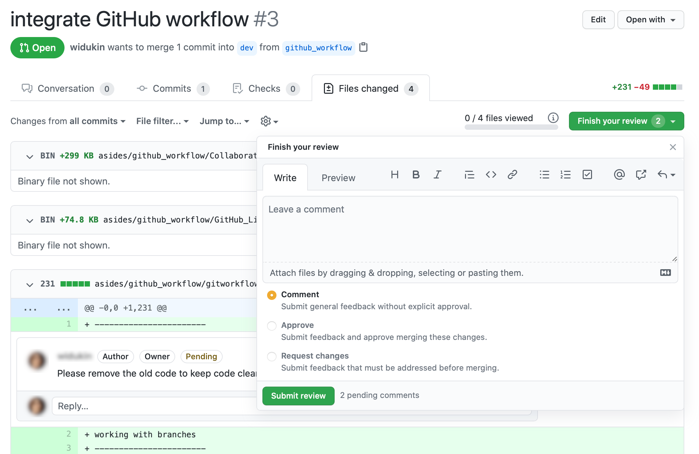

# GIT | GITHUB WORKFLOW

## Table of Contents

- [Set-up](#set-up)
- [Workflow](#workflow)
- [Bibliography](#bibliography)

## Set-up

### Admin

The initial Github and Git setup for the group project

1. Create a repository on Github
2. Clone the repository to your local System:

```
$ git clone [provided url on github]
```

3. Creating a developement branch locally:

```
$ git checkout -b [dev_branch_name]
```

4. Creating initial files or other initial changes to the repo:

```
$ touch index.html
$ touch style.css
$ git add .
$ git commit -m "first commit"
```

5. Pushing the dev branch to remote (no pulling needed yet, since there is no code):

```
$ git push origin [dev_branch_name]
```

6. Add your Team members as contributors on Github:
   

### Contributors

The initial setup for project contributors

1. Copy the project link on Github

   

2. Clone the github repository to your local System:

```
$ git clone [copyed url on github]
```

3. Make sure to be in the initial branch

It should be the default branch (usually main/master).

Either your git bash shows the branch you're on or you can call the git branch command and look for the branch with the star (\*):

```
$ git branch
```

4. Creating a developement branch locally:

```
$ git checkout -b [dev_branch_name]
```

## Workflow

Creating a new feature, implementing changes, fixing bugs.

1. Update your local development branch:

```
$ git checkout [development_branch_name]
$ git pull origin [development_branch_name]
```

2. Creating a working branch locally:

```
$ git checkout -b [work_branch_name]
```

3. Assure your are working on your working branch:

```
$ git branch
```

You should see all existing branches and your working branch with a star \*

4. Doing some work:

```
$ git add.
$ git commit -m "a good commit meassage"
```

5. After finishing your work push it to Github:

```
$ git push origin [work_branch_name]
```

6. Create a Pull Request

Make a new Pull Request on Github choosing the development branch as base and your working branch as the one to be compared with.

**Resolve conflicts!**

Give a meaningful title like "integrate feature xyz". Please no redundant information. Give it an good description as well. Add pictures as well.

Add reviewers to your PR.


### Handling pull requests

Merging should be a team approach.

1. Review

The assigned Reviewers do their review comments and approve or request changes on the PR.



2. Implement the required changes

Follow the [daily workflow steps](#daily_workflow).

3. Merge the Pull Request:
   

4. Delete your remote working branch
   

5. Delete your local working branch:

```
$ git checkout [development_branch_name]
$ git branch -d [working_branch_name]
```

6. Update the state of your local repo:

```
$ git fetch -p
```

making remote branches visible to the console:

```
$ git branch -r
```

making local and remote branches visible to the console:

```
$ git branch -a
```

### Merging dev branch with main branch

1. Create a pull request from the development branch to the main branch on github
2. Add Reviewers
3. Reviewing Process
4. Merge PR

**Do not delete the development branch!**

### Useful git commands

- getting an exact Copy of an remote branch on your local system:

```
$ git checkout --track origin/navbar
```

- getting an exact Copy of an remote branch on your local system:

```
$ git checkout --track origin/navbar
$ git checkout -b navbar origin/navbar
```

## Bibliography

- [Kunena-Forum on Github](https://github.com/Kunena/Kunena-Forum/wiki/Create-a-new-branch-with-git-and-manage-branches).
